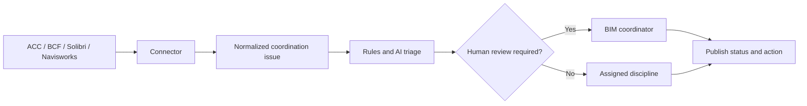

# BIM Coordination AI

A cloud-ready service for AI-assisted triage of BIM coordination issues. It
accepts normalized clashes or issues from tools such as Autodesk Construction
Cloud, BIM 360, Navisworks, Solibri, or BCF workflows, then proposes priority,
discipline ownership, tags, and a resolution action.

## Coordination workflow



The current MVP implements normalization and triage. Platform connectors,
persistence, authentication, and write-back are deliberate extension points.

## What it does

- Classifies issue priority from clearance, penetration, and safety context.
- Suggests a lead discipline and resolution action.
- Escalates life-safety and uncertain decisions to a BIM coordinator.
- Uses deterministic rules by default so the service works without an AI key.
- Supports any OpenAI-compatible chat-completions endpoint when configured.
- Processes batches concurrently through a FastAPI endpoint.

AI output is advisory. A qualified coordinator remains responsible for design,
safety, constructability, and contractual decisions.

## Run locally

```powershell
python -m venv .venv
.\.venv\Scripts\Activate.ps1
python -m pip install -e ".[dev]"
uvicorn bim_coordination_ai.main:app --reload
```

Open the interactive API documentation at
[http://localhost:8000/docs](http://localhost:8000/docs).

## Example request

```powershell
$body = @{
  issues = @(
    @{
      id = "CL-001"
      title = "Supply duct clashes with structural beam"
      source = "Solibri"
      location = "Level 05 / Grid B-4"
      element_ids = @("MEP-2388", "STR-1042")
      disciplines = @("mep", "structure")
      distance_mm = -75
    }
  )
} | ConvertTo-Json -Depth 5

Invoke-RestMethod `
  -Method Post `
  -Uri "http://localhost:8000/v1/triage" `
  -ContentType "application/json" `
  -Body $body
```

## Enable an AI provider

Set these environment variables before starting the API:

```powershell
$env:AI_API_KEY = "your-key"
$env:AI_BASE_URL = "https://api.openai.com/v1"
$env:AI_MODEL = "gpt-4.1-mini"
```

If the AI provider is unavailable or returns invalid output, the workflow falls
back to rules and flags the issue for human review.

## Run in a container

```powershell
docker build -t bim-coordination-ai .
docker run --rm -p 8000:8000 --env-file .env bim-coordination-ai
```

The image can be deployed to Azure Container Apps, AWS App Runner, Google Cloud
Run, or another OCI-compatible cloud platform.

## Recommended next connectors

1. **BCF 2.1/3.0** for vendor-neutral issue exchange.
2. **Autodesk Construction Cloud Issues API** for issue import and write-back.
3. **Solibri/Excel export** for rapid adoption in an existing checking process.
4. **Model metadata store** for project zones, systems, responsibility matrix,
   and issue history.

## Access from another laptop (same Cursor account)

Cursor does not sync local project folders across devices. Push this repo to
GitHub (or another Git remote), then clone it on your other laptop while signed
into the same Cursor account.

```powershell
# First time on this laptop (after creating an empty GitHub repo)
git add .
git commit -m "Initial BIM coordination AI workflow"
.\scripts\connect-github.ps1 -RemoteUrl "https://github.com/YOUR_USER/bim-coordination-ai.git"

# On the other laptop
git clone https://github.com/YOUR_USER/bim-coordination-ai.git
cd bim-coordination-ai
cursor .
.\scripts\setup.ps1
```

Project rules (`.cursor/rules/`), workspace settings, and source code travel
through Git. Chat history stays on each machine unless you use a separate sync
tool.

Full guide: [docs/cursor-multi-device.md](docs/cursor-multi-device.md)
